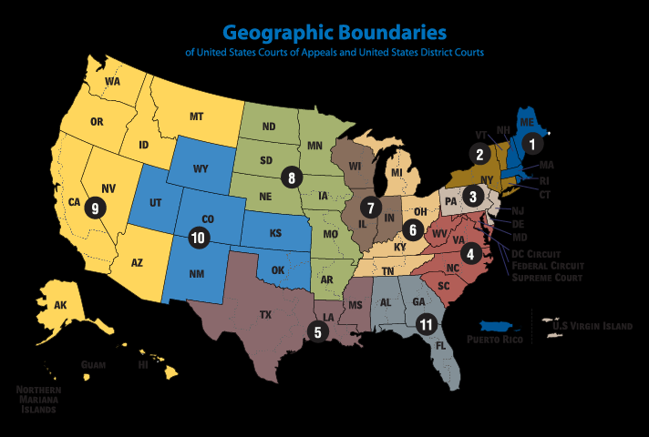

# Consent
- Consent Order
	- Ordered by court/judge resulting from litigation against a business entity
- Consent Decree
	- Voluntary 
	- Does not admit guilt
- often used interchangeably
### Facebook
- violated a consent order from FTC in 2011
- [link](https://www.ftc.gov/news-events/news/press-releases/2011/11/facebook-settles-ftc-charges-it-deceived-consumers-failing-keep-privacy-promises)
# LabMD
- Review [[Wyndham Failures]] because that is the most important, labmd is the second most important
- FTC judge originally agreed with LabMD on cybersecurity regulation.
-> victory for data security regulators
- BUT
- 11th circuit appellate court overturned the previous decision
	- [link](https://iapp.org/news/a/takeaways-from-the-11th-circuit-ftc-vs-labmd-decision/)
	- the court's opinion **turns on** the relief sought by the FTC, rather than the "violation" itself.
	- [another link](https://www.reuters.com/article/us-otc-labmd/theres-a-big-problem-for-the-ftc-lurking-in-11th-circuits-labmd-data-security-ruling-idUSKCN1J32S2/)

	
- This didn't really change anything from [[Wyndham Failures]]
## So What's Required for Protecting Data?
- Industry standard encryption
- Routine audits and pen testing expected 
- Health related data (as other sensitive data) requires especially strong safeguards
- Data security protection extends to paper documents
- B-2-B are also accountable to the FTC for security of sensitive data
- Responsible for vendors/3rd parties
- Training required
- Privacy matters even in data security
## Approaching Appendix A in the Textbook
- [link](https://www.law.cornell.edu/uscode/text/15/45)
- Look at organization of law:
	- (a) through (n) – what does each section do?
	- Terminology:
		- “unfair or deceptive acts”
		- “direct, substantial, and reasonably foreseeable”
		- “cease and desist”
		- “service” (Chapter 2 discussion)
- Processes
	- Timelines
	- Penalties 
	- Civil actions 
	- Consent orders 
	- Standard of proof 
		- Codified “Cigarette Rule”